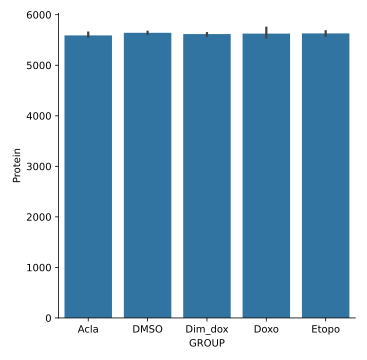

## [`seaborn`](https://seaborn.pydata.org/) is a popular library for statistical graphics that works well with Pandas DataFrames.

* seaborn produces its plots using matplotlib, which we saw in the previous episode.
* It is opinionated about how you should present your data to it, but in exchange it can produce sophisticated plots with little code.

* seaborn is usually imported using the alias "sns".

~~~
import seaborn as sns
~~~
{: .language-python}

## Seaborn plots using wide-form data

First let's load our Europe GDP dataset and convert the column labels into integer years as we did previously in the Pandas episode.
We'll also slice out the first five countries to create a manageable subset of the data.

~~~
import pandas as pd

data = pd.read_csv('data/gapminder_gdp_europe.csv', index_col='country')
# Extract year from last 4 characters of each column name
years = data.columns.str.strip('gdpPercap_')
# Convert year values to integers, saving results back to dataframe
data.columns = years.astype(int)

# Slice out the rows for the first 5 countries.
data_plot = data.iloc[:5]
# Transpose the dataframe so the countries are the columns.
data_plot = data_plot.T

data_plot
~~~
{: .language-python}
~~~
country      Albania       Austria       Belgium  Bosnia and Herzegovina      Bulgaria
1952     1601.056136   6137.076492   8343.105127              973.533195   2444.286648
1957     1942.284244   8842.598030   9714.960623             1353.989176   3008.670727
1962     2312.888958  10750.721110  10991.206760             1709.683679   4254.337839
1967     2760.196931  12834.602400  13149.041190             2172.352423   5577.002800
1972     3313.422188  16661.625600  16672.143560             2860.169750   6597.494398
1977     3533.003910  19749.422300  19117.974480             3528.481305   7612.240438
1982     3630.880722  21597.083620  20979.845890             4126.613157   8224.191647
1987     3738.932735  23687.826070  22525.563080             4314.114757   8239.854824
1992     2497.437901  27042.018680  25575.570690             2546.781445   6302.623438
1997     3193.054604  29095.920660  27561.196630             4766.355904   5970.388760
2002     4604.211737  32417.607690  30485.883750             6018.975239   7696.777725
2007     5937.029526  36126.492700  33692.605080             7446.298803  10680.792820
~~~
{: .output}

This data is organized in the so-called *wide form*. The table cells hold values of a single variable (in this case GDP per capita)
with two other identifying variables (year and country) encoded in the row and column labels. This may appear convenient and aligns
with how we generally organize things in spreadsheets but is actually quite limiting, most critically because it restricts us to
storing just three variables. Nonetheless, seaborn will do its best to accept data of this form. Later we will see a different way of
organizing dataframes that offers much more flexibility.

* `pairplot` builds a grid of pairwise comparisons between each numeric column in a dataframe.

~~~
sns.pairplot(data_plot, kind='reg')
~~~
{: .language-python}

* Cells on the diagonal contain single-variable histograms. Other cells show scatter plots between the associated columns of the wide
  table.
* `kind='reg'` adds linear regression fits with 95% confidence intervals.
* seaborn is not a substitute for explicit statistical analysis, rather it's intended to help uncover patterns during
  exploratory data analyses.

* `relplot` shows the relationship between two numerical variables as scatter or line plots.
* `catplot` shows the relationship between one numerical and one or more categorical variables. The numerical variable is often presented
  using a box plot or violin plot but there are many other options.
* Both plots can use small multiples, color, and plot styles to show groupings and subsets based on secondary variables.

~~~
sns.relplot(data_plot, kind='line')
sns.catplot(data_plot, kind='box')
~~~
{: .language-python}

* Because we passed a wide-form dataframe, we lose some beneficial features that seaborn can otherwise provide such as automatic axes labels
and tighter control over how the variables are mapped onto the plot's axes and visual aspects.
* For example we might want to show the boxplots in the catplot on the X-axis, but this isn't supported with wide-form data.
* seaborn offers many other plotting functions, most of which accept wide-form dataframes but likewise with limited functionality.

## Seaborn plots using long-form data

An alternative way to organize dataframes is the *long form*, in which every variable is stored in its own column, with the column label
providing its name. Every observation is stored as a separate row. This is often referred to as "tidy data" -- you can read more about this
concept in the paper *Tidy Data* by Hadley Wickham. seaborn works best with dataframes in this format, as it provides
maximum control over which variables to plot and map to the various visual presentation styles.

Long-form dataframes also support an unlimited number of variables! You can record every variable you think might be useful and decide
whether and how to plot it later.

* pandas offers many ways to move between wide-form and long-form data as well as refine messier data into a tidy form. `melt` converts
  from wide to long for some simple cases and will work well with our Europe GDP data.

* To demonstrate, we'll take a tiny rectangular slice of our GDP dataframe. We will turn the index back into a regular column, which
  will make using `melt` more straightforward.

~~~
melt_test = data.iloc[:3, :2].reset_index()
melt_test
~~~
{: .language-python}
~~~
   country         1952         1957
0  Albania  1601.056136  1942.284244
1  Austria  6137.076492  8842.598030
2  Belgium  8343.105127  9714.960623
~~~
{: .output}

* Now we call `melt` and specify that the `country` column is what identifies the rows in the original dataframe.

~~~
melt_test.melt(id_vars='country')
~~~
{: .language-python}
~~~
   country variable        value
0  Albania     1952  1601.056136
1  Austria     1952  6137.076492
2  Belgium     1952  8343.105127
3  Albania     1957  1942.284244
4  Austria     1957  8842.598030
5  Belgium     1957  9714.960623
~~~
{: .output}

* This looks good, but let's ask for more appropriate column names instead of the default `variable` and `value`.

~~~
melt_test.melt(id_vars='country', var_name='year', value_name='gdpPercap')
~~~
{: .language-python}
~~~
   country  year    gdpPercap
0  Albania  1952  1601.056136
1  Austria  1952  6137.076492
2  Belgium  1952  8343.105127
3  Albania  1957  1942.284244
4  Austria  1957  8842.598030
5  Belgium  1957  9714.960623
~~~
{: .output}

* Perfect! Now we will apply this `melt` transformation to the entire dataframe.
* Testing out data manipulation on a small subset of a large dataset is a useful technique. Just be sure your subset is representative of
  all the wrinkles and oddities of the full dataset.

~~~
data_long = data.reset_index().melt(id_vars='country', var_name='year', value_name='gdpPercap')
~~~
{: .language-python}

* We can call `relplot` and `catplot` on our long-form data and explicitly choose which variables we want (or don't want) on the x-axis,
  y-axis, and color mapping.
* The axes are now automatically labeled using the variable names we chose for each axis.

~~~
sns.relplot(data_long, kind='line', x='year', y='gdpPercap', hue='country')
sns.catplot(data_long, y='country', x='gdpPercap', kind='box')
~~~
{: .language-python}

## Plots using mass spectrometry data

We have been given a data file containing protein-level quantification from a series of mass spectrometry experiments. We would
like to perform a quality control check that the number of unique proteins detected for each treatment condition are comparable
and the variance between replicates is low.

* To begin, we load in the data file and examine the first 5 columns (the remaining columns are not relevant here).

~~~
prot = pd.read_csv('data/proteomics_protein_level_data.csv')

prot.iloc[:, :5]
~~~
{: .language-python}
~~~
        RUN      Protein  LogIntensities                   originalRUN  GROUP
0         1  1433B_HUMAN       15.088586   240805_Sarthy_Acla_chrom_01   Acla
1         2  1433B_HUMAN       14.783678   240805_Sarthy_Acla_chrom_02   Acla
2         3  1433B_HUMAN       15.178893   240805_Sarthy_Acla_chrom_03   Acla
3         4  1433B_HUMAN       15.194030   240805_Sarthy_DMSO_chrom_01   DMSO
4         5  1433B_HUMAN       14.852435   240805_Sarthy_DMSO_chrom_02   DMSO
...     ...          ...             ...                           ...    ...
101236   14   ZZZ3_HUMAN       12.360979   240805_Sarthy_Doxo_chrom_02   Doxo
101237   15   ZZZ3_HUMAN       12.300259   240805_Sarthy_Doxo_chrom_03   Doxo
101238   16   ZZZ3_HUMAN       12.142085  240805_Sarthy_Etopo_chrom_01  Etopo
101239   17   ZZZ3_HUMAN       12.467393  240805_Sarthy_Etopo_chrom_02  Etopo
101240   18   ZZZ3_HUMAN       12.379874  240805_Sarthy_Etopo_chrom_03  Etopo

[101241 rows x 5 columns]
~~~
{: .output}

* Our collaborator told us the `RUN` column denotes which of 18 separate mass spec runs each measurement belongs to, and the
  `GROUP` column contains the treatment condition.
* Let's try to groupby GROUP and compute the number of unique proteins in each group.

~~~
prot.groupby('GROUP')['Protein'].nunique()
~~~
{: .language-python}
~~~
GROUP
Acla       6021
DMSO       6222
Dim_dox    6057
Doxo       6073
Etopo      6043
Name: Protein, dtype: int64
~~~
{: .output}

* This looks close, but we want a separate protein count for each replicate run. This result lumps together the replicates for
  each treatment.
* If we add the RUN column to the groupby, each replicate will now fall into its own group giving us the desired result.

~~~
prot.groupby(['GROUP', 'RUN'])['Protein'].nunique()
~~~
{: .language-python}
~~~
GROUP    RUN
Acla     1      5564
         2      5562
         3      5645
DMSO     4      5644
         5      5660
         6      5678
         7      5589
         8      5630
         9      5652
Dim_dox  10     5629
         11     5634
         12     5586
Doxo     13     5741
         14     5587
         15     5551
Etopo    16     5633
         17     5671
         18     5585
Name: Protein, dtype: int64
~~~
{: .output}

* The RUN column is not quite the same thing as the actual within-treatment-group replicate number, but it serves our purposes
  here. This is often the case with imperfect data and it pays to think creatively about how to achieve your desired results.
* It looks like we could probably extract the true replicate numbers from the `originalRUN` column, but that is more work than
  necessary for our needs right now.

> ## Groupby aggregation order of operations
>
> How do these two expressions differ? Is one preferable over the other? Try evaluating the second one without the final
> `['Protein']` indexing and try to explain what is happening.
>
> ~~~
> prot.groupby('GROUP')['Protein'].nunique()
> prot.groupby('GROUP').nunique()['Protein']
> ~~~
> {: .language-python}
>
> > ## Solution
> >
> > Both evaluate to the same final result, but the second expression computes the number of unique values per group in _all_
> > columns in the dataframe and then throws away all the computed columns except for Protein. The first expression only ever
> > computes the unique values for the Protein column, so it's more efficient. Computers are fast so you may not notice the
> > difference until your next dataset is very large.
> >
> > BONUS: Use the `%timeit` IPython "magic" to time the performance of both expressions to see the difference for yourself.
> {: .solution}
{: .challenge}

* Now that we have a dataframe containing the values we want to plot, we will use `catplot` to display a bar plot with error bars
  showing the 95% confidence interval over the replicates for each treatment.

~~~
trt_unique_proteins = prot.groupby(['GROUP', 'RUN'])['Protein'].nunique().reset_index()
sns.catplot(trt_unique_proteins, x='GROUP', y='Protein', kind='bar')
~~~
{: .language-python}

> ## Groupby aggregation order of operations
>
> How might we also add a unique color to each bar in the previous plot? HINT: We already used this feature in a previous line
> plot.
>
> > ## Solution
> >
> > Add `hue='GROUP'` to the `catplot` argument list:
> > ~~~
> > sns.catplot(trt_unique_proteins, x='GROUP', y='Protein', kind='bar', hue='GROUP')
> > ~~~
> > {: .language-python}
> {: .solution}
{: .challenge}

We also have a second data file containing the measurements for the drug treatment conditions normalized by the DMSO carrier
control condition. The protein abundance values are reported as the base-2 log of the ratio to the control condition, and p-values
have also been computed. We will produce a volcano plot for each treatment condition to identify how many proteins show a strong
and statistically significant change relative to the control.

~~~
prot_fold = pd.read_csv('data/proteomics_model.csv')

prot_fold.iloc[:, :8]
~~~
{: .language-python}
~~~
           Protein         Label    log2FC        SE    Tvalue    DF    pvalue  adj.pvalue
0      1433B_HUMAN     Acla-DMSO  0.044903  0.207659  0.216233  13.0  0.832162    0.986773
1      1433B_HUMAN  Dim_dox-DMSO  0.175012  0.207659  0.842785  13.0  0.414586    0.751113
2      1433B_HUMAN     Doxo-DMSO  0.174600  0.207659  0.840803  13.0  0.415656    0.999459
3      1433B_HUMAN    Etopo-DMSO  0.250530  0.207659  1.206448  13.0  0.249142    0.999273
4      1433E_HUMAN     Acla-DMSO  0.100954  0.176954  0.570509  13.0  0.578061    0.974975
...            ...           ...       ...       ...       ...   ...       ...         ...
25163  ZZEF1_HUMAN    Etopo-DMSO -0.175627  0.250450 -0.701246  13.0  0.495512    0.999273
25164   ZZZ3_HUMAN     Acla-DMSO  0.265786  0.125187  2.123119  12.0  0.055228    0.728978
25165   ZZZ3_HUMAN  Dim_dox-DMSO  0.170327  0.125187  1.360584  12.0  0.198653    0.564757
25166   ZZZ3_HUMAN     Doxo-DMSO  0.037156  0.125187  0.296807  12.0  0.771688    0.999459
25167   ZZZ3_HUMAN    Etopo-DMSO  0.132035  0.125187  1.054707  12.0  0.312333    0.999273

[25168 rows x 8 columns]
~~~
{: .output}

* A volcano plot puts the log2 fold-change values on the X-axis and the negative base-10 log of the p-values on the Y axis. We
  need to compute the log-transformed p-values as a new column in to our dataframe.
* We will import the numpy package in order to call its `log10` function on an entire column of values.
* numpy is usually aliased as "np" on import.

~~~
import numpy as np
prot_fold['neg_log10_pvalue'] = -np.log10(prot_fold['pvalue'])
~~~
{: .language-python}

* We plot one variable against another with seaborn's `relplot`, passing `kind='scatter'`.
* The `col` parameter is used to split the observations from each treatment into separate plots on a grid.

~~~
sns.relplot(prot_fold, x='log2FC', y='neg_log10_pvalue', col='Label', kind='scatter')
~~~
{: .language-python}

* Let's color the points where the p-value is less than 0.05 and the fold change is above 0.5 or 1 log units.
* First we need to add a column that classifies the observations into these categories. We'll start off by creating a column with
  the default class value for all observations, then update just selected rows for the other classes.
* As we learned previously, seaborn uses matplotlib behind the scenes which means we can use knowledge of matplotlib to customize
  and tweak our seaborn plots. We'll also add a dashed lines to each plot to indicate the p=0.05 threshold.

~~~
strength_1 = (prot_fold['pvalue'] < 0.05) & (np.abs(prot_fold['log2FC']) > 0.5) & (np.abs(prot_fold['log2FC']) <= 1)
strength_2 = (prot_fold['pvalue'] < 0.05) & (np.abs(prot_fold['log2FC']) > 1)
prot_fold['strength'] = 0
prot_fold.loc[strength_1, 'strength'] = 1
prot_fold.loc[strength_2, 'strength'] = 2
grid = sns.relplot(prot_fold, x='log2FC', y='neg_log10_pvalue', col='Label', kind='scatter', hue='strength')
for ax in grid.axes.flat:
    ax.axhline(-log10(0.05), linestyle='--')
~~~
{: .language-python}

