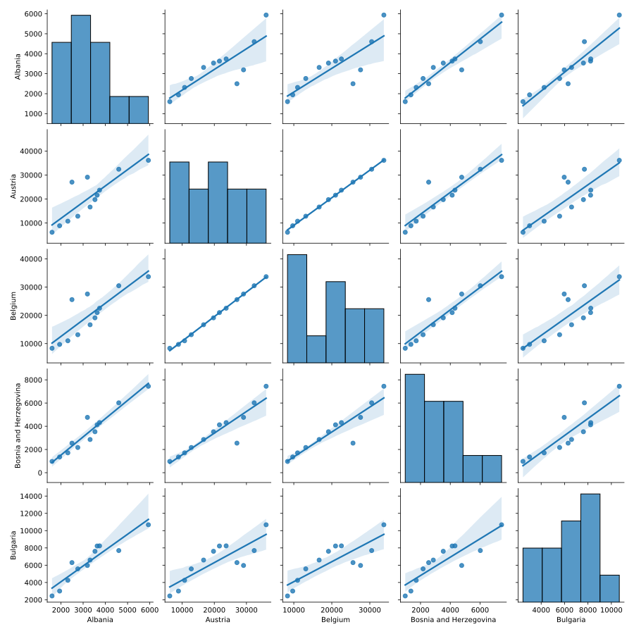
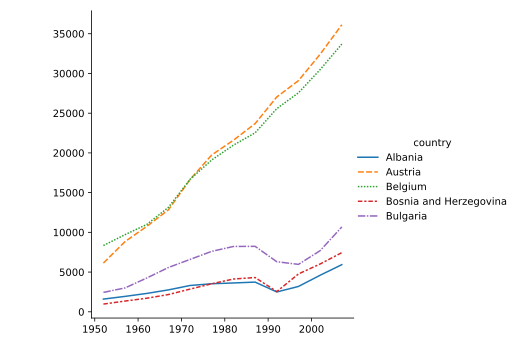
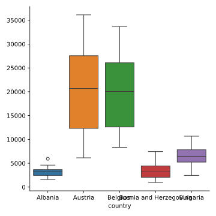
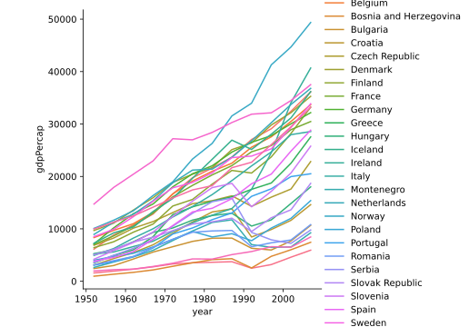
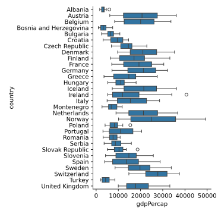

## [`seaborn`](https://seaborn.pydata.org/) is a popular library for statistical graphics that works well with Pandas DataFrames.

* seaborn produces its plots using matplotlib, which we saw in the previous episode.
* It is opinionated about how you should present your data to it, but in exchange it can produce sophisticated plots with little code.

* seaborn is usually imported using the alias "sns".

~~~
import seaborn as sns
~~~
{: .language-python}

## Seaborn plots using wide-form data

First let's load our Europe GDP dataset and convert the column labels into integer years as we did previously in the Pandas episode.
We'll also slice out the first five countries to create a manageable subset of the data.

~~~
import pandas as pd

data = pd.read_csv('data/gapminder_gdp_europe.csv', index_col='country')
# Extract year from last 4 characters of each column name
years = data.columns.str.strip('gdpPercap_')
# Convert year values to integers, saving results back to dataframe
data.columns = years.astype(int)

# Slice out the rows for the first 5 countries.
data_plot = data.iloc[:5]
# Transpose the dataframe so the countries are the columns.
data_plot = data_plot.T

data_plot
~~~
{: .language-python}
~~~
country      Albania       Austria       Belgium  Bosnia and Herzegovina      Bulgaria
1952     1601.056136   6137.076492   8343.105127              973.533195   2444.286648
1957     1942.284244   8842.598030   9714.960623             1353.989176   3008.670727
1962     2312.888958  10750.721110  10991.206760             1709.683679   4254.337839
1967     2760.196931  12834.602400  13149.041190             2172.352423   5577.002800
1972     3313.422188  16661.625600  16672.143560             2860.169750   6597.494398
1977     3533.003910  19749.422300  19117.974480             3528.481305   7612.240438
1982     3630.880722  21597.083620  20979.845890             4126.613157   8224.191647
1987     3738.932735  23687.826070  22525.563080             4314.114757   8239.854824
1992     2497.437901  27042.018680  25575.570690             2546.781445   6302.623438
1997     3193.054604  29095.920660  27561.196630             4766.355904   5970.388760
2002     4604.211737  32417.607690  30485.883750             6018.975239   7696.777725
2007     5937.029526  36126.492700  33692.605080             7446.298803  10680.792820
~~~
{: .output}

This data is organized in the so-called *wide form*. The table cells hold values of a single variable (in this case GDP per capita)
with two other identifying variables (year and country) encoded in the row and column labels. This may appear convenient
but is actually quite limiting, most critically because it restricts us to storing just three variables. Nonetheless, seaborn will
do its best to accept data of this form. Later we will see a different way of organizing dataframes that offers much more flexibility.

* `pairplot` builds a grid of pairwise comparisons between each numeric column in a dataframe.

~~~
sns.pairplot(data_plot, kind='reg')
~~~
{: .language-python}

* Cells on the diagonal contain single-variable histograms. Other cells show scatter plots between the associated columns.
* `kind='reg'` adds a linear regression line with 95% confidence intervals.
* seaborn is not a substitute for explicit statistical analysis, rather it's intended to help uncover patterns during
  exploratory data analyses.

* `relplot` shows the relationship between two numerical variables as scatter or line plots.
* `catplot` shows the relationship between one numerical and one or more categorical variables. The numerical variable is often presented
  using a box plot or violin plot but there are many other options.
* Both plots can use small multiples, color, and plot styles to show groupings and subsets based on secondary variables.

~~~
sns.relplot(data_plot, kind='line')
sns.catplot(data_plot, kind='box')
~~~
{: .language-python}

* Because we passed a wide-form dataframe, we lose some beneficial features that seaborn can otherwise provide such as automatic axes labels
and tighter control over how the variables are mapped onto the plot's axes and visual aspects.
* For example we might want to show the boxplots in the catplot on the X-axis, but this isn't supported with wide-form data.
* seaborn offers many many other plotting functions, most of which accept wide-form dataframes but likewise with limited functionality.

## Seaborn plots using long-form data

An alternative way to organize dataframes is the *long form*, in which every variable is stored in its own column, with the column label
providing its name. Every observation is stored as a separate row. seaborn works best with dataframes in this format, as it provides
maximum control over which variables to plot and map to the various visual presentation styles.

Long-form dataframes also support an unlimited number of variables! You can record every variable you think might be useful and decide
whether and how to plot it later.

* pandas offers many ways to move between wide-form and long-form data. `melt` converts from wide to long for some simple cases including
  our Europe GDP data.

* To demonstrate, we'll take a tiny slice of our GDP dataframe. We will turn the index back into a regular column, which will make using
  `melt` more straightforward.

~~~
melt_test = data.iloc[:3, :2].reset_index()
melt_test
~~~
{: .language-python}
~~~
   country         1952         1957
0  Albania  1601.056136  1942.284244
1  Austria  6137.076492  8842.598030
2  Belgium  8343.105127  9714.960623
~~~
{: .output}

* Now we call `melt` and specify that the `country` column is what identifies the rows in the original dataframe.

~~~
melt_test.melt(id_vars='country')
~~~
{: .language-python}
~~~
   country variable        value
0  Albania     1952  1601.056136
1  Austria     1952  6137.076492
2  Belgium     1952  8343.105127
3  Albania     1957  1942.284244
4  Austria     1957  8842.598030
5  Belgium     1957  9714.960623
~~~
{: .output}

* This looks good, but let's ask for more appropriate column names instead of the default `variable` and `value`.

~~~
melt_test.melt(id_vars='country', var_name='year', value_name='gdpPercap')
~~~
{: .language-python}
~~~
   country  year    gdpPercap
0  Albania  1952  1601.056136
1  Austria  1952  6137.076492
2  Belgium  1952  8343.105127
3  Albania  1957  1942.284244
4  Austria  1957  8842.598030
5  Belgium  1957  9714.960623
~~~
{: .output}

* Perfect! Now we will apply this `melt` transformation to the entire dataframe.

~~~
data_long = data.reset_index().melt(id_vars='country', var_name='year', value_name='gdpPercap')
~~~
{: .language-python}

* We can call `relplot` and `catplot` on our long-form data and explicitly choose which variables we want (or don't want) on the x-axis,
  y-axis, and color mapping.
* The axes are now automatically labeled using the variable names we chose for each axis.

~~~
sns.relplot(data_long, kind='line', x='year', y='gdpPercap', hue='country')
sns.catplot(data_long, y='country', x='gdpPercap', kind='box')
~~~
{: .language-python}

